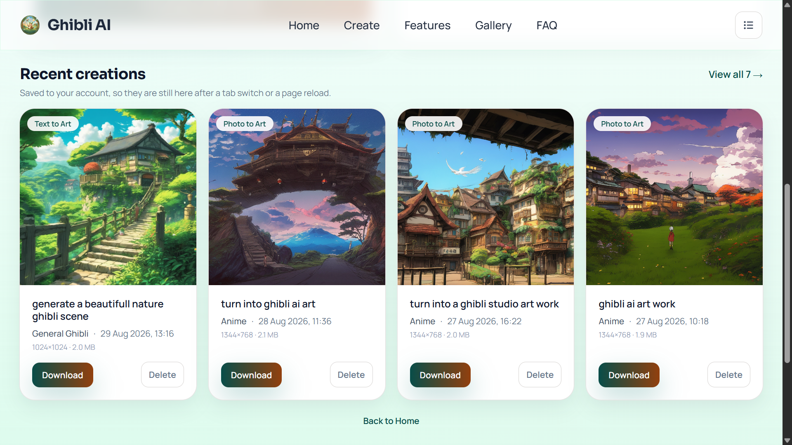
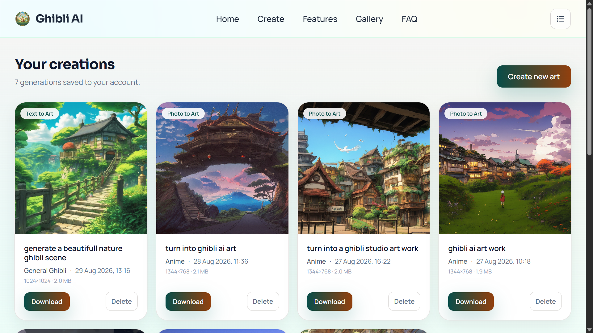
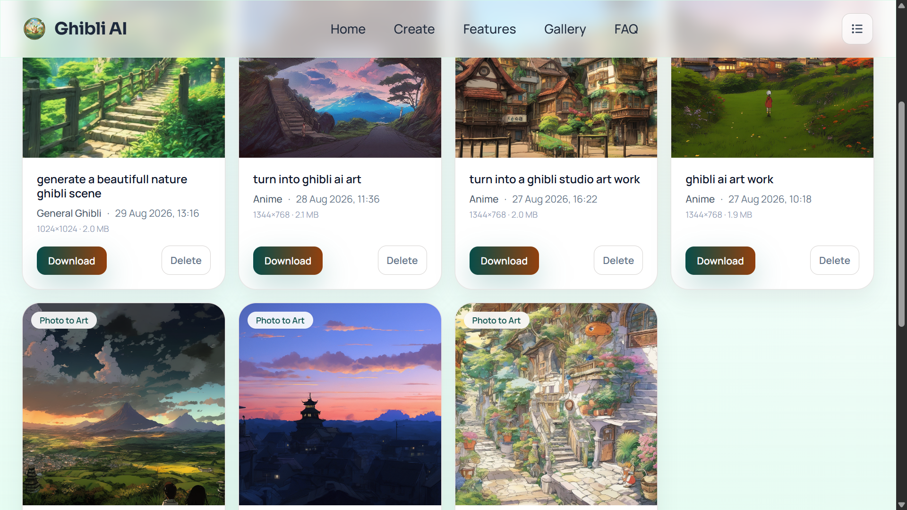
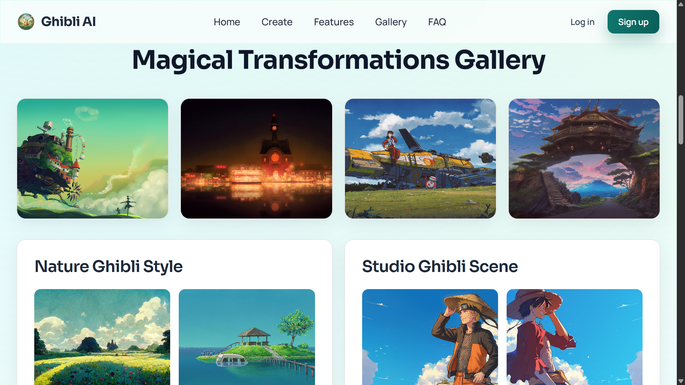
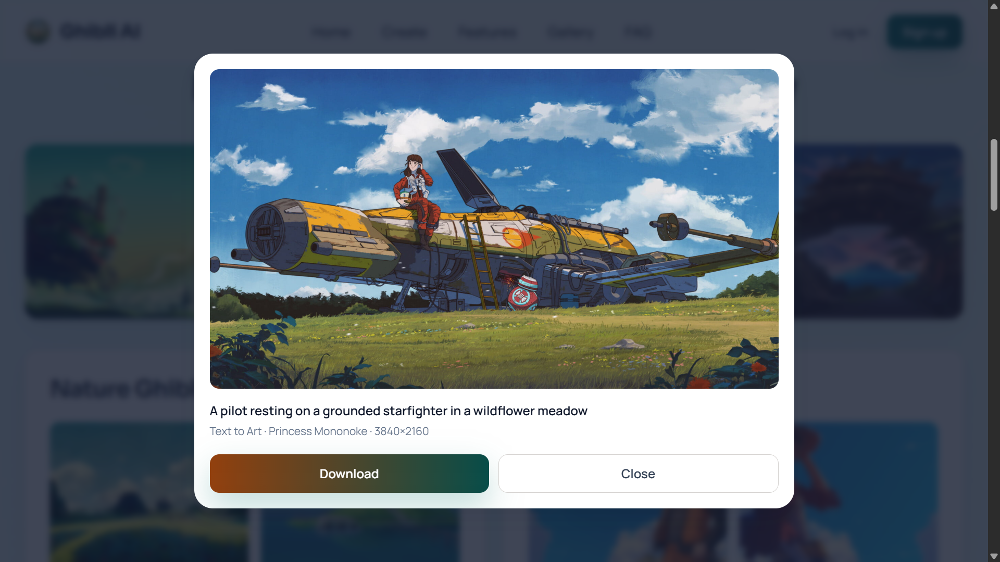

# Ghibli AI — API (`ghbliapi`)

A Spring Boot 3.5.3 / Java 21 REST API that turns a photo or a sentence into Studio Ghibli style
artwork through Stability AI SDXL, holds accounts behind stateless JWT, and stores every generated
PNG in MongoDB as history belonging to exactly one user.

**This is the backend document** — the documents, the request flow, the failure taxonomy, and the
reasoning behind each. The interface it serves is documented next door, in
[the frontend README](../ghbli-art-generator/README.md).

| | |
| --- | --- |
| **Runtime** | Java 21, Spring Boot 3.5.3, Tomcat; deployed on Render as a Docker image |
| **Data** | MongoDB Atlas — three collections, two of them written per generation |
| **Auth** | HS256 JWT, 24 h, stateless; **zero** database queries per authenticated request |
| **Upstream** | Stability AI SDXL, reached over **two different transports**, on purpose |
| **Errors** | RFC 9457 `application/problem+json` for every failure, without exception |

## Contents

- [One request, end to end](#one-request-end-to-end)
- [The domain in three documents](#the-domain-in-three-documents)
- [Request flow](#request-flow)
- [Design decisions](#design-decisions)
- [The error contract](#the-error-contract)
- [Security model](#security-model)
- [API reference](#api-reference)
- [Configuration](#configuration)
- [Local setup](#local-setup)
- [Deployment](#deployment)
- [The test suite](#the-test-suite)
- [Troubleshooting](#troubleshooting)
- [Screenshots](#screenshots)
- [Project layout](#project-layout)
- [Notes on the engineering](#notes-on-the-engineering)

## One request, end to end

Everything else in this file is detail on this one paragraph.

A browser sends `POST /api/v1/generate-from-text` with `Authorization: Bearer <jwt>`.
`JwtAuthenticationFilter` verifies the signature and rebuilds the principal from the claims — no
database round trip. `AuthorizationFilter` sees an authenticated context and lets the request
reach `GenerationController`, which hands the prompt and style to `GhibliArtService`. That appends
the Ghibli suffix, maps `analog_film` to Stability's `analog-film`, and calls SDXL through Feign.
Stability answers with PNG bytes. The controller then calls
`GenerationHistoryService.recordQuietly(…)`, which writes the image document, then the metadata
document, and **swallows anything that goes wrong** — the user has already waited on a paid
generation they can see, so bookkeeping is never allowed to fail the request. The bytes go back as
raw `image/png`.

## The domain in three documents

Three collections. The split between the last two is the most load-bearing storage decision in the
project.

### `users` — [`model/User.java`](src/main/java/in/suhansingh/ghbliapi/model/User.java)

| Field | BSON | Why it is there |
| --- | --- | --- |
| `_id` | ObjectId → `String` | Also the JWT subject, so a token identifies its owner with no lookup |
| `email` | String, **unique index** | Login identity. Trimmed and lower-cased by `setEmail`, because Mongo string comparison is case-sensitive and `Bob@x.com` would otherwise become a second account |
| `password` | String | BCrypt hash, never plaintext. `@JsonIgnore` *and* excluded from `@ToString`, so it can reach neither a response body nor a log line |
| `name` | String | Display name, shown in the account menu |
| `roles` | Array\<String\> | Authorities with the `ROLE_` prefix already applied; defaults to `ROLE_USER` |
| `createdAt` | Date | Set in the constructor rather than by auditing — auditing arrived with `Generation` |

### `generations` — [`model/Generation.java`](src/main/java/in/suhansingh/ghbliapi/model/Generation.java)

Metadata only. **Never the image bytes.**

| Field | BSON | Why it is there |
| --- | --- | --- |
| `_id` | ObjectId → `String` | The public handle. The image endpoint is addressed by *this* id, not by the image id |
| `userId` | String, **index prefix** | Owner. Always the JWT subject; never a body, query or header value |
| `type` | String enum | `TEXT_TO_IMAGE` or `IMAGE_TO_IMAGE` — what the history card badges |
| `prompt` | String | As the user typed it, *without* the `", in the beautiful, detailed anime style of studio ghibli."` suffix the service appends |
| `style` | String | The style the user chose; for photo-to-art, the fixed preset that endpoint applies |
| `engineId` | String | So old rows stay explainable after an engine swap |
| `imageId` | String | `_id` of the `GenerationImage`. A plain `String`, deliberately **not** a `@DBRef` |
| `width` / `height` | Int32, nullable | Read back out of the returned PNG header, so they describe what SDXL produced rather than what was requested |
| `imageSizeBytes` | Int64, nullable | Kept on the light document precisely so a grid can show a size without fetching a megabyte |
| `createdAt` | Date | Stamped by `@CreatedDate`, which needs `@EnableMongoAuditing` — see `MongoAuditingConfig`. Without it this stays null, nothing is logged, and the history sort quietly degenerates |

### `generation_images` — [`model/GenerationImage.java`](src/main/java/in/suhansingh/ghbliapi/model/GenerationImage.java)

| Field | BSON | Why it is there |
| --- | --- | --- |
| `_id` | ObjectId → `String` | Referenced by `Generation.imageId` |
| `userId` | String | Duplicated from the owning `Generation`, on purpose — the image fetch re-asserts ownership instead of trusting one query to have been written correctly |
| `data` | **BinData subtype 0** | The raw PNG. `@JsonIgnore` so a future handler returning the entity cannot base64 a megabyte into a JSON body |
| `contentType` | String | Always `image/png` today; stored so the image endpoint never has to assume |

### Three facts worth knowing before changing any of it

**The unique email index exists only because a property says so.** Spring Data MongoDB flipped
auto-index creation to `false` in 3.0, so `@Indexed(unique = true)` on `User.email` is inert
without `spring.data.mongodb.auto-index-creation=true`. Inert means *two accounts can share one
address, silently, for months*. `UserIndexTest` asserts the index physically exists at runtime
rather than trusting the annotation. `AuthService.signup` then leans on it twice: an `existsByEmail`
check produces the ordinary 409, and a `DuplicateKeyException` catch turns the loser of a signup
race into the same 409 instead of a 500.

**One index serves the only query.** `@CompoundIndex(def = "{'userId': 1, 'createdAt': -1}")`
answers the equality match *and* the sort from a single B-tree, so Mongo never sorts in memory. Two
single-field indexes could not do that — it would use one, then sort the matched set. There is
deliberately no separate `@Indexed` on `userId` either: `userId` is the index prefix, so a
userId-only query already uses this index, and a second one would cost a write per insert and buy
no read. A named index is a one-way door — Mongo raises `IndexKeySpecsConflict` on startup rather
than altering an existing index, so with auto-creation on, the definition had to be right the first
time rather than iterated on.

**`generation_images` has no index at all, and that is the correct number.** Every read arrives as
`findByIdAndUserId`, served by the mandatory `_id` index with `userId` applied as a filter on the
single matched document. An index on `userId` would be paid for on every insert and never used.

## Request flow

### Photo to Art — `POST /api/v1/generate`

1. `JwtAuthenticationFilter` verifies the bearer token and populates the `SecurityContext`. A bad
   token is *not* an exception here — see [Security model](#security-model).
2. `GenerationController.generateGhibliArt` receives the `image` and `prompt` parts.
3. `GhibliArtService.createGhibliArt` rejects anything over **5 MB** with an
   `IllegalArgumentException` → 400, before a byte leaves the building. That is Stability's own
   `init_image` ceiling, not a local preference.
4. `resizeImageToStabilityDimensions` decodes the upload and redraws it at whichever of SDXL's
   **nine allowed dimension pairs** — 1024×1024, 1152×896, 1216×832, 1344×768, 1536×640, 640×1536,
   768×1344, 832×1216, 896×1152 — has the closest aspect ratio to the original. Skipping this step
   is an `invalid_sdxl_v1_dimensions` 400 from Stability for most real photographs.
5. The three parts — `init_image`, `text_prompts[0][text]`, `style_preset=anime` — are posted with
   the injected `RestTemplate`, **not** Feign, for a measured reason:
   [Two transports](#two-transports-to-stability-on-purpose).
6. A non-2xx goes to `StabilityErrorTranslator`, which classifies from the status *and* the body.
   No response at all is classified from the exception chain instead.
7. PNG bytes come back. The controller calls `recordQuietly(IMAGE_TO_IMAGE, prompt, null, bytes)`,
   which writes both documents and cannot throw.
8. `ResponseEntity.ok().contentType(IMAGE_PNG).body(bytes)`.

### Text to Art — `POST /api/v1/generate-from-text`

1. `TextGenerationRequestDTO` is `@Valid`: `prompt` is `@NotBlank` and at most 2000 characters;
   `style` *defaults* to `general` rather than being required, because an absent style is a valid
   request and not a client error.
2. `GhibliArtService.createGhibliArtFromText` appends the same Ghibli suffix, then maps the style —
   `null`, blank and `general` all become Stability's `anime` preset, and anything else has `_`
   replaced with `-`, so `analog_film` goes out as `analog-film`.
3. `StabilityAIClient` (Feign) posts `TextToImageRequest` as JSON. Any non-2xx is converted at the
   boundary by `StabilityErrorDecoder` — the last place the response *body* is still readable, and
   the body is what separates a moderation refusal from a malformed request.
4. `recordQuietly(TEXT_TO_IMAGE, prompt, requestedStyle, bytes)`, then the raw PNG.

### Reading history — `GET /api/v1/generations`

1. `@Min(0) int page` and `@Min(1) @Max(100) int size` are validated by Spring Framework itself (no
   `@Validated` on the class — 6.1+ applies parameter constraints directly and raises
   `HandlerMethodValidationException`, which already has a ProblemDetail 400). Out of range is a
   **400, not a clamp**.
2. `GenerationHistoryService.list` calls `CurrentUser.requireId()` — the only way this application
   ever learns who is calling.
3. `findByUserIdOrderByCreatedAtDesc(userId, PageRequest.of(page, size))`. The `Pageable` carries no
   `Sort`, because Spring Data *merges* a sorted `Pageable` with an `OrderBy` method name rather
   than letting either override the other.
4. Entities become `GenerationSummaryResponse` inside a `PageResponse` envelope. Nothing in this
   path touches `generation_images`: `Generation` holds no `byte[]`, and `imageId` is a plain
   `String` with no mapping hook that could fetch the other collection behind the reader's back.

The bytes are a **second**, separately owner-scoped lookup:
`GET /generations/{id}/image` → `findByIdAndUserId` on the generation (this is the authorization
decision), then `findByIdAndUserId` on the image. Two single-document reads by `_id` is what the
storage split costs, and it is cheap.

## Design decisions

### Two transports to Stability, on purpose

Text-to-image goes through OpenFeign (`StabilityAIClient`). It sends a JSON body, which the
declarative client handles cleanly.

Image-to-image does **not**. It is posted by `GhibliArtService` with an injected `RestTemplate`, and
the reason is measured rather than assumed — see
[`FeignMultipartEncodingTest`](src/test/java/in/suhansingh/ghbliapi/client/FeignMultipartEncodingTest.java),
which encodes the real request and asserts on the bytes Feign would put on the wire. In short:
`feign-form` (a non-optional dependency of `spring-cloud-starter-openfeign`) routes a Spring
`Resource`-typed `@RequestPart` to its catch-all `PojoWriter`, which reflects over declared fields
and skips final ones. `ByteArrayResource` has exactly one field, `private final byte[] byteArray`,
so the `init_image` part is written as nothing at all — **with no exception and no log**. The other
two parts encode correctly, so Stability answers with a 400 naming `init_image`, which reads like a
caller bug rather than an encoder fault. The resize step is what forces the issue: it produces
`byte[]`, never the original `MultipartFile` that `feign-form` does handle.

`RestTemplate` encodes all three parts correctly, so it stays. `StabilityHttpClientConfig` gives it
explicit 10 s connect / 60 s read timeouts, because the default constructor's infinite timeouts
would let a hung Stability connection pin a Tomcat worker thread indefinitely.

### Why MongoDB

The stored shape is a document, not a set of related rows: a generation is one prompt, one style,
one engine id, one set of PNG dimensions and one blob, read back as a whole or not at all. There are
no joins in the read path — history is `findByUserIdOrderByCreatedAtDesc`, served by a compound
index — and nothing here needs a transaction across aggregates. The PNG matters too: a `byte[]` maps
directly to BSON BinData, so image bytes live in the same store as their metadata without a second
system or a filesystem to keep in sync.

### Why BinData in a separate collection, not GridFS

Two decisions, often confused with each other.

**Separate collection** (`generation_images`, one document per image). Mongo returns whole documents
unless a projection is spelled out, so the reliable way to keep 1–2 MB of binary out of a paginated
list query is for the bytes not to be in the listed document at all. `Generation` holds metadata and
an `imageId`; `GenerationImage` holds the blob. The list endpoint never touches the image
collection, so a page of twelve rows costs kilobytes. `GenerationRepositoryTest` pins the no-bytes
property by reflection, so a future field of an array type fails the build rather than quietly
fattening the list response.

**Not GridFS.** MongoDB recommends GridFS for files above the 16 MB BSON document limit. An SDXL PNG
is 1–2 MB, an order of magnitude below it. GridFS would add chunk assembly on every read, its own
two collections, and ObjectId/hex-string plumbing, in exchange for a ceiling this data never
approaches.

### Bookkeeping never fails a generation

[`GenerationHistoryService.recordQuietly`](src/main/java/in/suhansingh/ghbliapi/service/GenerationHistoryService.java)
catches `Exception` and logs. That is the requirement, not defensive habit: by the time it runs, the
user has waited on a paid Stability call that produced an image they can see. Letting a Mongo
timeout, a paused Atlas cluster or a bug in that method turn it into a 500 would destroy the
artifact in order to protect the record of it. So the failure mode is deliberately asymmetric — the
PNG always goes back on the wire, and a failure costs a history row plus an ERROR log line carrying
the owner and the prompt, so the row can be reconstructed.

Four smaller choices inside it, each of which had an obvious-looking alternative:

- **Synchronous, not `@Async`.** It adds a few milliseconds of Mongo write to a request that just
  spent seconds at Stability — and the `SecurityContext` does **not** propagate to another thread by
  default, so an async version would find no user id and silently record nothing. Being synchronous
  also means the row is committed before the response is sent, which is what lets the frontend
  refresh history on a generation event without racing the write.
- **Image document first, metadata second, no transaction.** These are two documents with no
  invariant that must hold atomically for the rest of the system to be correct. The order still is
  not arbitrary: metadata-first would leave, on a failure, a visible history row whose image
  endpoint 404s. Image-first leaves unreferenced bytes that nothing can reach.
- **A compensating `deleteById`** if the metadata save throws — a storage optimisation, not a
  correctness fix, and if it too fails the log line names the orphaned id.
- **`applyDimensions` uses an `ImageReader`, not `ImageIO.read`.** Decoding a 1024×1024 PNG into a
  `BufferedImage` costs roughly 4 MB of heap to learn two integers; the reader parses the header
  only, and is `dispose()`d in a `finally` because ImageIO pools readers. Failure is not an error
  condition — an undecodable response still deserves a history row, so the fields stay null.

### Ownership is structural, not checked

There is no `if (generation.getUserId().equals(currentUser))` anywhere in this codebase, and that is
the design rather than an omission.

- **No handler accepts a user id.** Not as a path variable, not as a query parameter, not as a
  header. `GenerationHistoryController`'s three methods take a page, a size and a generation id —
  nothing else. So there is no input a caller could tamper with.
- **The only source of identity is the `SecurityContext`.**
  [`CurrentUser`](src/main/java/in/suhansingh/ghbliapi/security/CurrentUser.java) type-checks the
  principal and returns its id; `requireId()` throws `AccessDeniedException` rather than returning
  null, so a missing identity is a 403 and never an unscoped query. It deliberately does not use
  `authentication.getName()` — that is the email, not the id the documents are keyed by.
- **The owner is part of the query, not a check after it.** `findByIdAndUserId`,
  `deleteByIdAndUserId`, `findByUserIdOrderByCreatedAtDesc`. Mongo never returns a document the
  caller does not own, so there is no window in which owned and unowned data are both in hand.
- **A cross-user id is a 404, not a 403.**
  [`GenerationNotFoundException`](src/main/java/in/suhansingh/ghbliapi/exception/GenerationNotFoundException.java)
  is raised for "no such id" *and* "exists but is not yours", because 403 would confirm the id is
  real — an oracle anyone could walk to enumerate other users' generations without ever reading one.
  The answers to "does this exist?" and "is this mine?" have to be the same answer. Same reasoning
  the login endpoint already uses for an unknown address versus a wrong password.

Deletion applies the same shape: `delete` removes the metadata with `deleteByIdAndUserId` and reads
the returned count. Zero means "not yours or not there" → 404. One means the row was ours, so the
image document is deleted next, and a failure there is logged rather than raised — the user asked for
it to be gone, and it is gone from everything they can see.

## The error contract

**Every** failure is RFC 9457 `application/problem+json`. Not most; every one — bean validation,
a bad login, a missing token, an unowned id, an upstream refusal, an unhandled `NullPointerException`.
[`GlobalExceptionHandler`](src/main/java/in/suhansingh/ghbliapi/exception/GlobalExceptionHandler.java)
extends `ResponseEntityExceptionHandler`, so even the framework's own failures (unreadable JSON,
missing request part, upload over the multipart limit, wrong method) arrive in the same shape instead
of Boot's default error map. Successful responses are untouched: they stay raw `image/png` bytes.

```json
{
  "type": "about:blank",
  "title": "Validation failed",
  "status": 400,
  "detail": "prompt must not be blank",
  "instance": "/api/v1/generate-from-text",
  "errors": { "prompt": "must not be blank" }
}
```

`errors` is the extra the frontend's forms depend on — a field → message map added by
`handleMethodArgumentNotValid`, so a signup form can mark the offending input instead of only showing
a banner. `instance` is the request URI, which is why `server.forward-headers-strategy=framework`
matters behind Render's TLS terminator.

### The seven ways a generation can fail upstream

Before [`StabilityFailure`](src/main/java/in/suhansingh/ghbliapi/enums/StabilityFailure.java) existed,
an empty balance, a rate limit, a rotated key, a refused prompt and a total outage all reached the
browser as the same *502 "Generation failed"* — so the UI could print exactly one sentence, and the
user could not tell "wait ten seconds" from "top up the account". One enum now carries the whole
decision per case: the status **this** API answers with, a stable `code`, a title, a default sentence,
and whether pressing the button again could plausibly work.

| Upstream cause | Status out | `code` | `retryable` |
| --- | --- | --- | --- |
| Stability 402 — balance empty | **402** | `stability_credits_exhausted` | `false` |
| Stability 429 — rate limited | **429** | `stability_rate_limited` | `true` |
| Stability 401/403 — our key rejected | **502** | `stability_auth_failed` | `false` |
| Content filter refused prompt or photo | **422** | `stability_request_rejected` | `false` |
| Upstream 5xx, or connection never opened | **503** | `stability_unavailable` | `true` |
| Connection opened, no answer in 60 s | **504** | `stability_timeout` | `true` |
| Anything with no specific rule | **502** | `stability_error` | `false` |

Two rows deserve their reason spelled out. A rejected **API key** answers 502, not 401: the *caller*
authenticated perfectly well, it is this server's upstream credential that is wrong, and a 401 would
send the frontend into a re-login that fixes nothing. And `UNKNOWN` is `retryable: false` on purpose —
guessing "yes" would have the UI invite a retry into an unknown failure.

Four properties ride along beyond the standard ProblemDetail fields, each because the frontend cannot
work it out for itself:

| Property | Present when | What consumes it |
| --- | --- | --- |
| `code` | always, on a Stability failure | the frontend's wording table; status alone is ambiguous (502 covers two causes) and matching on `detail` text breaks the moment a sentence is reworded |
| `retryable` | always, on a Stability failure | whether a "Try again" button is offered at all. The one thing the UI must never guess — offering a retry on an empty balance is a lie |
| `upstreamStatus` | when Stability answered at all | diagnostics; absent for a connection that never opened |
| `retryAfterSeconds` | when the upstream sent a usable `Retry-After` | the countdown on a 429 |

When `retryAfterSeconds` is set, a real `Retry-After` **header** travels with the response as well
(RFC 9110 §10.2.3) — which is the only reason `handleStabilityApiException` returns a `ResponseEntity`
instead of a bare `ProblemDetail`. `StabilityErrorTranslator.parseRetryAfterSeconds` accepts only a
numeric value between 1 and 3600, so an HTTP-date form or an absurd value is dropped rather than
turned into a countdown nobody would wait out.

### One classifier, two transports

The two network seams are different code —
[`StabilityErrorDecoder`](src/main/java/in/suhansingh/ghbliapi/client/StabilityErrorDecoder.java) for
Feign, a catch ladder in `GhibliArtService` for `RestTemplate` — but both call the same
[`StabilityErrorTranslator`](src/main/java/in/suhansingh/ghbliapi/exception/StabilityErrorTranslator.java).
That is what makes it impossible for the two paths to classify the same 402 differently.

Classification reads the status **and** the body, in that order of subtlety:

- Credit markers (`"insufficient_balance"`, `"insufficient credits"`, and friends) are checked
  *before* the status switch, because Stability has answered 400 and 403 for an empty balance at
  different times. The check is skipped for 401/403 responses that look like auth, so a rejected key
  is not mistaken for an empty wallet.
- A plain 400 with no moderation or credit marker becomes `UNKNOWN`, not `REQUEST_REJECTED` — a
  malformed request of ours is not the user's prompt being refused.
- With no response at all, `classify(Throwable)` walks the cause chain up to eight links deep,
  separating a read timeout (`504`) from a connection that never opened (`503`).
- The upstream body is logged, abbreviated, at WARN, and **never** returned to the client. It is the
  most useful diagnostic in the system and also the one most likely to contain something the caller
  has no business reading.

### Everything else

| Situation | Status | Where |
| --- | --- | --- |
| `@Valid` body failed | 400 + `errors` map | `handleMethodArgumentNotValid` |
| Page/size out of range | 400 | Spring 6.1 `HandlerMethodValidationException` — no `@Validated` needed |
| Upload over 5 MB, or any service-side guard | 400 | `handleIllegalArgument` |
| Signup on a taken address, or losing a signup race | 409 | `EmailAlreadyExistsException` **and** Mongo's `DuplicateKeyException`, same handler |
| Wrong password, or unknown address | 401, identical detail | `handleAuthenticationException` — the endpoint cannot enumerate accounts |
| Missing or invalid bearer token | 401 | `ProblemDetailAuthenticationEntryPoint`, in the filter chain |
| Authenticated but not permitted | 403 | `handleAccessDenied` |
| Unowned or unknown generation id | 404 | `handleGenerationNotFound` |
| Anything unforeseen | 500, fixed sentence | `handleUnexpected` — logs the stack trace, returns none of it |

## Security model

Stateless, header-only, and built so that the expensive part of authentication happens once at login
rather than on every request.

**The token is the whole session.** `AuthService.login` goes through `AuthenticationManager`, so
`MongoUserDetailsService` loads the document, BCrypt verifies the password, and `JwtService.generate`
signs an HS256 token whose **subject is the Mongo `_id`** — plus two custom claims, `email` and
`roles`. Nothing is stored server-side.

**Zero database queries per authenticated request.**
[`JwtAuthenticationFilter`](src/main/java/in/suhansingh/ghbliapi/security/JwtAuthenticationFilter.java)
verifies the signature and rebuilds a `UserPrincipal` from the claims. No user lookup, no session
table, no cache to invalidate. The cost is a **revocation window**: a token stays valid for its full
24 hours even if the account is deleted, because nothing on the request path consults the database to
notice. That is the trade this project chose; a deployment that needs immediate revocation needs a
denylist, and that would be a database read per request again.

**The filter never throws.** Every failure mode — expired, wrong signature, malformed, absent — is
caught and the request simply continues *unauthenticated*. This matters because the filter sits
upstream of `ExceptionTranslationFilter`, so an exception escaping it would surface as a **500**, not a
401. Instead `AuthorizationFilter` sees an empty context, denies the request, and
`ProblemDetailAuthenticationEntryPoint` writes the 401. Each cause gets its own `catch` so the log
line names it — expired, signature does not verify, unparseable — but all three are logged at **debug**
and none writes to the response: logging an invalid token at warn would let anyone flood the log by
sending junk headers, and the entry point owns the body so there is exactly one place that shapes a
401.

**401, not 403, for a missing token.** Spring Security's default when no entry point is configured is
`Http403ForbiddenEntryPoint` — so out of the box an unauthenticated call answers 403, and the frontend
cannot tell "log in" from "you may not have this". `ProblemDetailAuthenticationEntryPoint` fixes both
halves: the status, and the body, which is a ProblemDetail like everything else rather than Spring's
HTML error page.

**What the filter chain decides, and what it does not.**
[`SecurityConfig`](src/main/java/in/suhansingh/ghbliapi/config/SecurityConfig.java) establishes *that*
there is a user; it never decides *which rows* are theirs — that is
[Ownership is structural](#ownership-is-structural-not-checked). Its notable lines:

- `csrf` disabled — safe **only** because the policy is `STATELESS` and the token travels in a header.
  CSRF needs the browser to attach credentials automatically; nothing here does. Reintroducing cookie
  auth would make that line a vulnerability.
- `httpBasic`, `formLogin` and `logout` explicitly disabled. The starter turns the first two on by
  default, and a Basic prompt plus a login form on a bearer-token API is attack surface with no caller.
- `permitAll` for exactly two things: `/api/v1/auth/**`, and **GET** on `/actuator/health` — anonymous
  because that is what Render polls to decide a deploy is live and what an uptime pinger hits to keep a
  free instance warm. Safe only in combination with
  `management.endpoints.web.exposure.include=health`, which is what keeps `/actuator/env` off the HTTP
  surface entirely.
- `anyRequest().authenticated()` last, so any endpoint a later change adds is closed until someone
  opens it.
- CORS lives here rather than on a `@CrossOrigin` annotation, and origins come from
  `app.cors.allowed-origins`. Entries containing `*` are routed to `setAllowedOriginPatterns` and the
  rest to `setAllowedOrigins`, because Spring compares the latter literally — a `*` there silently
  never matches. That split is what lets one environment variable cover the fixed Vercel origin and
  its per-deployment preview URLs. `allowCredentials` is `false`: credentials mean cookies, and this
  API carries its token in a header.

Passwords are BCrypt at strength 10, and `SignupRequest` caps the password at **72 characters** because
that is BCrypt's input limit — beyond it the algorithm silently truncates, so two long passwords
sharing a 72-byte prefix would both authenticate. `User.password` is `@JsonIgnore` *and* excluded from
`@ToString`, so it can reach neither a response body nor a log line; `UserJsonTest` asserts that.

## API reference

Base path `/api/v1`. Every response body is JSON except the two generation endpoints and the image
endpoint, which return raw `image/png`.

### Auth — no token required

| | |
| --- | --- |
| `POST /auth/signup` | `{ name, email, password }` → **201** with a usable token, so there is deliberately no follow-up login call. `name` ≤ 100, `email` a well-formed address ≤ 254, `password` 8–72. The address is trimmed and lower-cased *before* validation. **409** if taken. No `Location` header — the created user is not a fetchable resource on this API |
| `POST /auth/login` | `{ email, password }` → **200**. **401** with the identical detail `"Incorrect email or password."` for a wrong password *and* an unknown address |

Both return the same body:

```json
{
  "token": "eyJhbGciOiJIUzI1NiJ9…",
  "tokenType": "Bearer",
  "expiresIn": 86400,
  "userId": "66cf1e2b9a4d3c0f5e8b1234",
  "name": "Suhan",
  "email": "suhan@example.com",
  "roles": ["ROLE_USER"]
}
```

`expiresIn` is **seconds** (RFC 6749), while `jwt.expiration` in the properties file is
**milliseconds** — `JwtService.getExpiresInSeconds()` is the one place that conversion happens. It is
sent so the client can show a countdown without trusting its own clock to match the server's.

### Generation — `Authorization: Bearer <token>` required

| | |
| --- | --- |
| `POST /generate` | `multipart/form-data`: `image` (≤ 5 MB, resized server-side) + `prompt`. → **200** `image/png` |
| `POST /generate-from-text` | `{ "prompt": "…", "style": "spirited_away" }` — `prompt` non-blank ≤ 2000, `style` optional and defaulting to `general`. → **200** `image/png` |

Failures on both are the [seven-row table](#the-seven-ways-a-generation-can-fail-upstream), and a
**429 or 503 may carry a real `Retry-After` header** alongside `retryAfterSeconds` in the body.

### History — `Authorization: Bearer <token>` required

| | |
| --- | --- |
| `GET /generations?page=0&size=12` | `page` ≥ 0, `size` 1–100. Out of range is a **400, not a clamp**. Newest first, always — there is no `sort` parameter |
| `GET /generations/{id}/image` | → **200** `image/png`, `Cache-Control: max-age=86400, private`, `Content-Disposition: inline; filename="ghibli-<id>.png"`. **404** for an id that is not yours |
| `DELETE /generations/{id}` | → **204**. Deleting twice gives 204 then **404** |

```json
{
  "content": [
    {
      "id": "66cf1e2b9a4d3c0f5e8b9abc",
      "type": "TEXT_TO_IMAGE",
      "prompt": "a hillside bakery at dawn",
      "style": "spirited_away",
      "engineId": "stable-diffusion-xl-1024-v1-0",
      "width": 1024,
      "height": 1024,
      "imageSizeBytes": 1483920,
      "createdAt": "2026-08-26T10:15:30.123Z"
    }
  ],
  "page": 0, "size": 12, "totalElements": 7, "totalPages": 1,
  "first": true, "last": true, "numberOfElements": 7
}
```

Note what `content` does **not** contain: no bytes, and no `imageId`. The image is addressed by the
*generation* id. `width`, `height` and `imageSizeBytes` are nullable for rows whose PNG header could
not be read.

### Health — anonymous

`GET /actuator/health` → `{"status":"UP"}`. Mongo is deliberately **not** part of the aggregate status
(`management.health.mongo.enabled=false`); see [Deployment](#deployment).

## Configuration

Every sensitive value is an environment variable. `application.properties` is tracked by git and holds
no literal secrets — set these in your shell, IDE run configuration, or the Render dashboard, never by
replacing the `${…}` placeholders.

| Variable | Required | Notes |
| --- | --- | --- |
| `JWT_SECRET` | **yes** | Base64-encoded HS256 key, ≥ 32 bytes after decoding. The only variable with **no default** — the app refuses to start without it, which is intentional: a fallback here would mean tokens signed with a key that is in the repository |
| `MONGODB_URI` | in practice | `mongodb+srv://…` from Atlas › Connect › Drivers, with `/ghbli` as the database. Empty default, so an unset var starts happily against `127.0.0.1:27017` and nothing says so |
| `STABILITY_API_KEY` | for generating | `sk-…`. Absent, the app starts and every generation fails upstream |
| `CORS_ALLOWED_ORIGINS` | deployment only | Comma-separated. An entry containing `*` becomes a pattern, so `https://ghbli-ai.vercel.app,https://ghbli-ai-*.vercel.app` covers production *and* Vercel previews. Defaults to `http://localhost:3000,http://127.0.0.1:3000` |
| `PORT` | never by hand | Injected by Render; `server.port=${PORT:8080}` |
| `STABILITY_TEXT_ENGINE` / `STABILITY_IMAGE_ENGINE` | no | Both default to `stable-diffusion-xl-1024-v1-0` |

Fixed properties worth knowing: `spring.data.mongodb.auto-index-creation=true` (without it the unique
email index does not exist), `jwt.expiration=86400000` (24 h, in **milliseconds**),
`spring.servlet.multipart.max-file-size=20MB` (the framework's ceiling — the *real* limit is the
service's 5 MB guard, which produces a clean 400 instead of a 413), and
`server.forward-headers-strategy=framework` so URLs the app builds behind Render's TLS terminator say
`https`. `application-example.properties` is the annotated reference; keep the two in step.

**Frontend configuration is not documented here.** It has exactly one variable,
`VITE_API_BASE_URL` — see [the frontend README](../ghbli-art-generator/README.md#setup).

## Local setup

**Prerequisites** — JDK 21, a MongoDB you can reach (Atlas free tier or a local `mongod`), and a
Stability AI key from [platform.stability.ai](https://platform.stability.ai/account/keys).

```bash
cd ghbliapi
export JWT_SECRET="$(openssl rand -base64 32)"
export MONGODB_URI="mongodb+srv://…/ghbli?retryWrites=true&w=majority"
export STABILITY_API_KEY="sk-…"
./mvnw spring-boot:run
```

On Windows PowerShell, `$env:JWT_SECRET = "…"` and `.\mvnw.cmd spring-boot:run`. The wrapper here is
`distributionType=only-script` (wrapper 3.3.4, Maven 3.9.14), so there is no `maven-wrapper.jar` to
check in — the script fetches the distribution on first run.

Verify it is up:

```bash
curl -s http://localhost:8080/actuator/health
```

Then the frontend, in a second terminal:

```bash
cd ghbli-art-generator && npm install && npm run dev
```

It serves on **port 3000**, pinned in `vite.config.mjs`, because that is what
`SecurityConfig.DEFAULT_ALLOWED_ORIGINS` allows. Vite's own default 5173 is deliberately absent from
that list — it is not a port anything in this repo serves on, so a stray `--port 5173` produces CORS
failures with a perfectly green server log. Everything else about the frontend lives in
[its own README](../ghbli-art-generator/README.md).

## Deployment

The backend is a **Docker image on Render**; the frontend is a Vercel project. The blueprint is
[`render.yaml`](../render.yaml) at the **repository root**, not inside `ghbliapi/`, because Render reads
one blueprint per repo.

- **`runtime: docker` is not a preference.** Render's native runtimes are Node, Python, Ruby, Go, Rust
  and Elixir. There is no Java runtime, so a Spring Boot service has to ship as an image.
- **`rootDir: ghbliapi`** scopes build triggers, so a push touching only the frontend does not rebuild
  the API. `dockerfilePath` and `dockerContext` are relative to the **repository** root while `rootDir`
  is not — that asymmetry is Render's, and getting it wrong fails the build with "Dockerfile not found".
- **`JWT_SECRET: generateValue: true`** — Render generates a random base64 256-bit value, which is
  exactly what `JwtService` expects. Rotating it logs everyone out. The other three are `sync: false`,
  meaning Render prompts once and stores nothing in git.
- **`healthCheckPath: /actuator/health`**, and this is why
  `management.health.mongo.enabled=false`: Render fails a deploy when the health check answers non-200,
  so with the Mongo indicator in the aggregate status a paused Atlas cluster would take the whole
  service down instead of only failing the calls that need a database.
- The [`Dockerfile`](Dockerfile) is two stages — `maven:3.9-eclipse-temurin-21` to build, `21-jre` to
  run. `pom.xml` is copied on its own layer ahead of the sources so the ~200 MB dependency layer is
  reused by every push that changed only Java files. Tests are skipped in the image build on purpose
  (flapdoodle downloads a real `mongod`; that signal belongs in CI). The runtime stage adds a non-root
  `spring` user, `JAVA_TOOL_OPTIONS=-XX:MaxRAMPercentage=75` (the container default of 25 % would cap a
  512 MB free instance's heap near 128 MB and OOM once a 20 MB upload, its result and both documents
  are live at once), and an exec-form `ENTRYPOINT` so `java` is PID 1 and actually receives Render's
  `SIGTERM`.

Free instances spin down when idle, so the first request after a quiet period pays a cold start. That is
the other reason `/actuator/health` is anonymous — an uptime pinger can keep it warm.

## The test suite

**19 classes**, run with `./mvnw test`. The integration ones start a real `mongod` through Flapdoodle
(`de.flapdoodle.embed.mongo.spring3x`, pinned to a 7.0.x binary), so the first run downloads roughly
100 MB into a local cache and is slow — after that it is fast.

They are not evenly interesting. Most cover an HTTP contract or a query. Six exist because something
would otherwise fail **silently**, and those are the ones worth reading:

| Test | What would silently break without it |
| --- | --- |
| [`FeignMultipartEncodingTest`](src/test/java/in/suhansingh/ghbliapi/client/FeignMultipartEncodingTest.java) | The two-transports decision. It encodes the exact request `createGhibliArt` builds and asserts on the bytes Feign *would* put on the wire, so "Feign drops the `init_image` part" is a measurement rather than a story |
| [`UserIndexTest`](src/test/java/in/suhansingh/ghbliapi/model/UserIndexTest.java) | The unique email index. Query Mongo for it, because `@Indexed` is inert without `auto-index-creation=true` and nothing warns — duplicate emails just insert cleanly |
| [`EmbeddedMongoCanaryTest`](src/test/java/in/suhansingh/ghbliapi/config/EmbeddedMongoCanaryTest.java) | The whole suite's meaning. A real `mongod` on 127.0.0.1:27017 means a misconfigured suite talks to the live database and passes green while embedded Mongo never starts |
| [`ConfigurationCompletenessTest`](src/test/java/in/suhansingh/ghbliapi/config/ConfigurationCompletenessTest.java) | `application-example.properties` rotting. Adding a key to the live file breaks nobody's build and surfaces later as somebody else's failed startup. It has already caught one real drift |
| [`SecurityConfigDeploymentTest`](src/test/java/in/suhansingh/ghbliapi/config/SecurityConfigDeploymentTest.java) | CORS and the anonymous health check — the two pieces that only exist for the deployed setup and cannot be exercised locally. A health check answering 401 makes Render roll back every deploy |
| [`GenerationPersistenceFailureTest`](src/test/java/in/suhansingh/ghbliapi/service/GenerationPersistenceFailureTest.java) | The asymmetry: a broken repository for the whole context, asserting the user still gets their PNG |

Three more guard specific past bugs: `StabilityHttpClientConfigTest` (the infinite-timeout
`new RestTemplate()`), `GhibliArtServiceStyleTest` (a null style throwing an `NPE` into an empty 500),
and `DeprecatedApiSweepTest`, which asserts that removed Spring Security DSL forms and pre-0.12 jjwt
APIs stay absent — every one of them *compiles*, so a copy-paste from an older tutorial would otherwise
fail at a point far from the paste.

`UserJsonTest` is the smallest and the one whose regression is a security bug rather than a test
failure: it serialises a `User` through the application's own auto-configured `ObjectMapper` and asserts
the BCrypt hash is not in the output.

```bash
cd ghbliapi && ./mvnw test
```

## Troubleshooting

| Symptom | Cause |
| --- | --- |
| App will not start: `Could not resolve placeholder 'JWT_SECRET'` | It is the one variable with no default. Set it — `openssl rand -base64 32` |
| Startup fails on `WeakKeyException` or `DecodingException` | `JWT_SECRET` is not valid Base64, or decodes to fewer than 32 bytes. `JwtService` translates both into an `IllegalStateException` carrying the fix |
| Every generation returns 502 `stability_auth_failed` | `STABILITY_API_KEY` is unset, expired or revoked. The app starts fine without it |
| 402 `stability_credits_exhausted` | The Stability balance is empty. Nothing in the code can retry past this |
| Generation returns 400 naming `init_image` | The resize step was bypassed, or something reintroduced Feign on the photo path. See [Two transports](#two-transports-to-stability-on-purpose) |
| History is empty although generations succeed | Look for the `recordQuietly` ERROR line — it never fails the request, so this is the only evidence. Also check `@EnableMongoAuditing`: without it `createdAt` stays null |
| Two accounts share one email | `spring.data.mongodb.auto-index-creation` is not `true`, so the unique index was never created |
| Browser reports a CORS failure, server log is clean | The origin is not in `CORS_ALLOWED_ORIGINS`. Most often the dev server came up on 5173 instead of 3000 |
| Render marks the deploy failed but the app looks healthy | `/actuator/health` must answer 200 anonymously. Check that `management.endpoints.web.exposure.include` still includes `health` |
| Startup connects to `127.0.0.1:27017` instead of Atlas | `MONGODB_URI` is unset. The empty default makes this silent |
| Tests pass but nothing is in embedded Mongo | Read `EmbeddedMongoCanaryTest` — the suite is talking to your local `mongod` |

## Screenshots

Fifteen screens, captioned here by **what the API is doing behind them** — the endpoint each one
exercises, the query it issues, the status it renders. The same fifteen images are captioned from the
interface side in [the frontend README](../ghbli-art-generator/README.md#screenshots).

Two honest notes. **S3** shows the signed-in account menu open over the CTA band, not just the footer —
if you read an older revision of this file calling it "Footer", that caption was stale. And **S2, S4 and
S5 predate the current header**: they show the old `G` avatar with a single `Create` button rather than
today's logo mark with Log in / Sign up. Their captions describe the panel content, which is accurate;
the header chrome in them is one iteration old.

### S1 — Landing page, the only fully anonymous view

Nothing here needs a token. Every other screen below either sends one or is about getting one.


### S2 — What the API is asked to do

The two capabilities map exactly onto the two POST endpoints: `POST /api/v1/generate` (multipart) and
`POST /api/v1/generate-from-text` (JSON).


### S3 — A signed-in session, and the site's own map

The account menu is rendered from the JWT claims — `name` and `email` came back in the `AuthResponse`
and are held client-side, so drawing this costs the API nothing.


### S4 — `POST /api/v1/generate` — multipart in, `image/png` out

The upload is capped at 5 MB by `GhibliArtService` before a byte leaves the server, then redrawn to the
nearest allowed SDXL dimension pair and posted to Stability with `RestTemplate`.


### S5 — `POST /api/v1/generate-from-text` — JSON in, `image/png` out

`prompt` is `@NotBlank` and ≤ 2000 characters; `style` is optional. The Ghibli suffix is appended
server-side, so what the user typed is what gets stored in `generations.prompt`.


### S6 — Where the style vocabulary comes from

The film names the interface leans on here are the same vocabulary the `style` field carries. `general`
maps to Stability's `anime` preset; every other value has `_` swapped for `-`, so `analog_film` goes out
as `analog-film`. This section itself is static content — it makes no API call.



### S7 — `GET /generations?page=0&size=4`, behind the Create form

The recent strip is the history endpoint with a small page size. "View all 7 →" is `totalElements` from
the `PageResponse` envelope, not a count the client kept. Each thumbnail is a separate
`GET /generations/{id}/image`.


### S8 — What the two collections actually hold

The stored/never-stored split on this page is the data model, in prose: `generations` keeps the prompt,
the style, the engine id and the PNG dimensions; `generation_images` keeps the bytes; `users` keeps a
BCrypt hash that no endpoint can return.


### S9 — The contract, in the words a user reads

Static content, no API call. Worth including because the retention and ownership claims on this page are
the ones `findByIdAndUserId` and `deleteByIdAndUserId` have to keep.


### S10 — `GET /generations?page=0&size=12` → `PageResponse`

Twelve is `DEFAULT_PAGE_SIZE`. The order is `findByUserIdOrderByCreatedAtDesc`, served entirely by the
compound index, so Mongo never sorts in memory. Nothing on this screen touched `generation_images` until
the thumbnails loaded.



### S11 — The same query, scrolled, with no `sort` parameter

There is deliberately no way to ask for a different order. A `?sort=prompt` would be *merged* with the
`OrderBy` in the method name, producing `{prompt: 1, createdAt: -1}` — an index the database does not
have, and a sort that can hit Mongo's 32 MB in-memory limit.



### S12 — `POST /auth/signup` → **201** with a usable token

No follow-up login call: the response already carries the token, so the client is signed in when this
form resolves. The 8–72 character rule the field states is BCrypt's input limit, enforced by
`SignupRequest`. A taken address is a 409 — from the `existsByEmail` check, or from the unique index if
two signups race.


### S13 — `POST /auth/login` → **200**, one error string for both causes

A wrong password and an unknown address return the identical detail. That is `AuthenticationManager` plus
`handleAuthenticationException` refusing to let the endpoint enumerate accounts.


### S14 — The same metadata line the API produces, over a curated image

These gallery tiles are static assets, so no request is made — but the caption under them is built by
the *same* `typeLabel` / `styleLabel` helpers a real history card uses, from the same stored values
(`TEXT_TO_IMAGE`, `digital_art`). One vocabulary across the app, which is why "Text to Art · Princess
Mononoke" here reads identically to a row that came out of `GenerationSummaryResponse`.



### S15 — Three curated rows, in the generator's own vocabulary

Static images again, no API call. Included because it is what the `style` presets are aiming at, and
because every tile carries a `type` and a `style` drawn from the values `generations` actually stores.



## Project layout

```
ghbliapi/
├── src/main/java/in/suhansingh/ghbliapi/
│   ├── client/          StabilityAIClient (Feign) + StabilityErrorDecoder
│   ├── config/          SecurityConfig, AuthenticationConfig, MongoAuditingConfig,
│   │                    StabilityHttpClientConfig, StabilityApiProperties, FeignConfig
│   ├── controller/      AuthController, GenerationController, GenerationHistoryController
│   ├── dto/             AuthResponse, PageResponse, GenerationSummaryResponse, requests
│   ├── enums/           GenerationType, StabilityFailure
│   ├── exception/       GlobalExceptionHandler, StabilityErrorTranslator, the exceptions
│   ├── model/           User, Generation, GenerationImage
│   ├── repository/      UserRepository, GenerationRepository, GenerationImageRepository
│   ├── security/        JwtService, JwtAuthenticationFilter, CurrentUser, UserPrincipal,
│   │                    MongoUserDetailsService, ProblemDetailAuthenticationEntryPoint
│   └── service/         AuthService, GhibliArtService, GenerationHistoryService
├── src/main/resources/  application.properties, application-example.properties, static/
├── src/test/java/…      19 test classes
├── Dockerfile           two-stage; Render has no Java runtime
└── pom.xml              Boot 3.5.3, Java 21, Spring Cloud OpenFeign, jjwt 0.13
```

The Blueprint that deploys it, [`render.yaml`](../render.yaml), sits one level up at the repository root.

## Notes on the engineering

A short list of the things in here that were decided rather than defaulted, each with the reason
compressed to one line. Most are expanded above.

- **Two transports to one upstream** because `feign-form` writes a `ByteArrayResource` part as nothing at
  all, silently — measured in a test rather than assumed.
- **Bytes in their own collection** because Mongo returns whole documents unless a projection says
  otherwise, so keeping a megabyte out of a paginated list means keeping it out of the listed document.
- **No GridFS**, because a 1–2 MB PNG is an order of magnitude under the 16 MB BSON limit GridFS exists to
  work around.
- **One compound index**, `{userId: 1, createdAt: -1}`, answering the only query's match *and* sort from a
  single B-tree — and no second index on `userId`, which the prefix already covers.
- **Zero index on `generation_images`**, because every read is by `_id`.
- **Zero database queries per authenticated request**, paid for with a 24 h revocation window, stated
  rather than hidden.
- **Ownership expressed as a query, not a check**, so there is no window where owned and unowned data are
  both in hand — and 404 rather than 403, so the endpoint is not an existence oracle.
- **Bookkeeping that cannot fail a generation**, because the alternative destroys a paid artifact to
  protect the record of it.
- **One error shape for every failure**, with `code` and `retryable` on upstream ones because the UI must
  not guess whether "Try again" is a lie.
- **Seven named upstream failures** instead of one 502, so the sentence a user reads matches what actually
  went wrong.
- **A PNG header parsed with an `ImageReader`**, not decoded with `ImageIO.read`, because two integers do
  not justify 4 MB of heap.
- **Tests that assert on infrastructure** — that an index physically exists, that embedded Mongo really
  started, that the example properties file is complete — because each of those fails silently otherwise.

## License

For educational and portfolio use. Studio Ghibli names and films are referenced descriptively; this
project is unaffiliated with Studio Ghibli.


